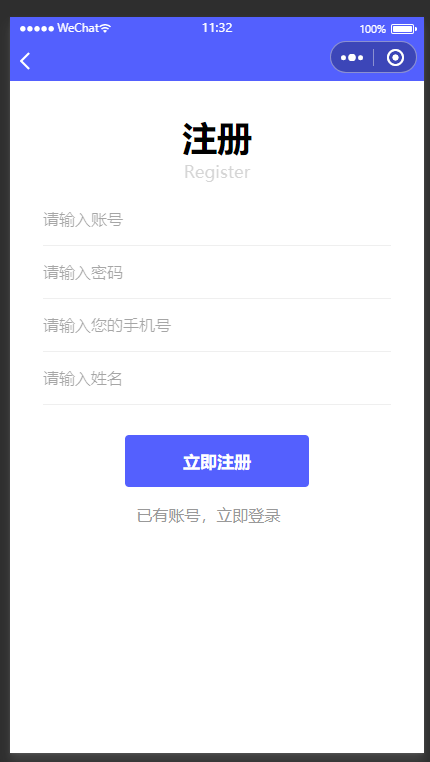
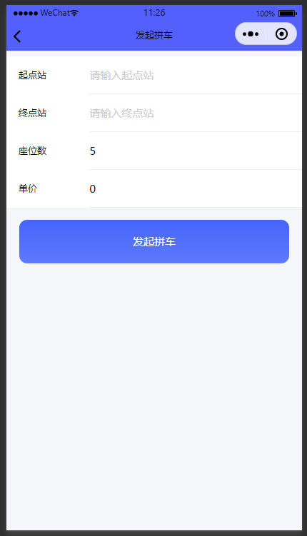

# 基于Java+SpringBoot+Vue校园互助小程序(源码+数据库)

### 作者QQ：3275035005 微信：xkbishe123 (支持修改、 部署调试、 代做接毕业设计和课程设计)

### 网站建设、小程序、H5、APP、各种系统、样式修改、10000套源码可选。

### 选题+开题报告+任务书+程序定制+安装调试+论文+答辩ppt 都可以做

### 问题包修改，包满意，有需求尽管甩过来！一条龙帮你安心过！

### 所有项目以及源代码本人均调试运行无问题 可支持远程调试运行

# 项目介绍
基于Java+SpringBoot+Vue校园互助小程序-毕业设计，本系统分小程序端、管理端、商家端三部分，项目采用前后端分离开发

### 1. 用户

用户登录注册、首页通知信息、首页推荐互助、拼车出行信息、发布拼车出行、二手商品信息、发布二手商品、学习资讯分析、学习资讯信息、学习资讯订阅、结实同学、帮领快递、发布帮领快递、参加互助、发布互助、学习打卡、查看打卡记录、发布失物招领、发布寻物启事、个人信息修改、我的帮领记录、我的购买记录、密码修改、退出登录

### 2. 管理员

管理员登录、系统首页、学习咨询信息管理、学习咨询分类管理、通知公告管理、二手物品管理、物品订单管理、失物招领管理、寻物启事管理、用户信息管理、个人信息修改、密码修改、退出登录

# 技术框架
- 开发语言：Java8
- 数据库：Mysql5.7以上
- 系统环境：jdk8、maven、node
- 后端框架：SpringBoot、MyBatisplus、MyBatis
- 前端框架：Vue、Elementui
- 工具：IDEA、Navicat、微信开发者工具
- 技术架构：前后端分离、B/S架构、MVC架构
# 项目截图

### 1. 用户端

### 2. 管理端

